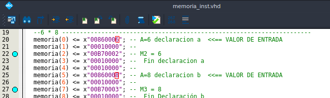

# Proyecto de Organización y Arquitectura de Computadoras 2022-1

## Objetivo

El alumno programará las instrucciones necesarias para poder ejecutar un
algoritmo sobre una arquitectura de computadora diseñada por el alumno.

## Algoritmo

Se debe implementar el algoritmo que permita obtener el área de un octágono.
Se usará la siguiente formula: ;
siendo el perímetro y el apotema números enteros.

## Instrucciones

1. Abrimos Quartus de manera normal y abrimos el archivo
   [`Risc/pipeline.qpf`](./Risc/pipeline.qpf).
   
   
   
   
   
2. Preparamos las variables en las líneas 20 y 25 de
[`memoria_inst.vhd`](./Risc/memoria_inst.vhd).
   
   
   
3. Compilamos con `ctrl + l`.
3. Comprobamos con el simulador abriendo el archivo
   
   
   
   
   
   
   
   
   
   [`Waveform.vwf`](./Risc/Waveform.vwf).
4. Revisamos en `ACCB_D`si el resultado es el correcto. En la siguiente imágen
   se muestra la operación  
   
   

## Estado Actual

El programa se define en [`memoria_inst.vhd`](./Risc/memoria_inst.vhd)

Y las instrucciones en [`u_control.vhd`](./Risc/u_control.vhd)

- [X] **Multiplicación**. Se trabaja en un ciclo para sumar la entrada dada. 
- [X] **División**. Para simular la división entre dos se correrá un bit a la derecha con la instrucción `ASRB` o `ASR`.

Se termina la multiplicación y la división, el resultado se almacena en `ACCB`.

En las líneas 20 y 25 de [`memoria_inst.vhd`](./Risc/memoria_inst.vhd) se
"declaran" los dos números a tratar (apotema y perimetro).

# Referencias

+ [P. M. (1999). *68HC11 Programmer’s Reference Manual*.](https://ecampus.matc.edu/lokkenr/elctec-141/68hc11ur.pdf)
+ J. J., & G. V. (n.d.). Diseño de microprocesadores. México: Facultad de Ingeniería.
